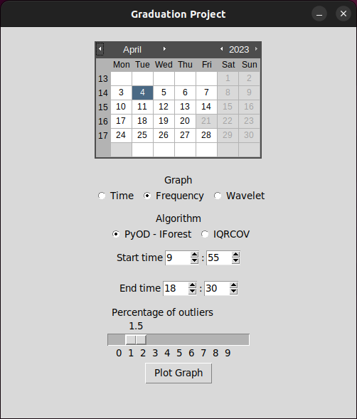

# Analysis and Data Display System of Stock Exchange Data in Frequency Domain
2nd Semester Graduation Project Source Codes - Melihcan Çilek

## Table of Contents
1. [Introduction](#1-introduction)
2. [Requirements](#2-requirements)
3. [Installation](#3-installation)
4. [Usage](#4-usage)
    1. [grad_prod.py](#41-grad_prodpy)
    2. [grad_cons.py](#42-grad_conspy)
5. [Examples](#5-examples)
    1. [UI](#51-ui)
    2. [Time Graph](#52-time-graph)
    3. [Frequency Graph](#53-frequency-graph)
    4. [Wavelet Graph](#54-wavelet-graph)
6. [References](#6-references)
7. [License](#7-license)
8. [Author](#8-author)
9. [Supervisor](#9-supervisor)
10. [Acknowledgements](#10-acknowledgements)


## 1. Introduction
Project uses Borsa Istanbul's Intraday Transaction Book Information and process them with Fourier Transform to find the most dominant frequencies. 

## 2. Requirements
* Python 3.6
* Numpy
* Pandas
* Matplotlib 2.2
* Scipy
* PyQT 5.9.2
* Python 3 TK

## 3. Installation
* Install Python 3.6 - [Python 3.6](https://www.python.org/downloads/release/python-360/)
``` bash
sudo apt-get install python3.6
```

* Install pip3 - [pip3](https://pip.pypa.io/en/stable/installation/)
``` bash
sudo apt-get install python3-pip
```

* Install Numpy - [Numpy](https://docs.scipy.org/doc/numpy/user/install.html)
``` bash
pip install numpy
```

* Install Pandas - [Pandas](https://pandas.pydata.org/pandas-docs/stable/install.html)
``` bash
pip install pandas
```

* Install Matplotlib - [Matplotlib](https://matplotlib.org/users/installing.html)
``` bash
pip install matplotlib
```

* Install Scipy - [Scipy](https://www.scipy.org/install.html)
``` bash
pip3 install scipy
```

* Install PyQT5 - [PyQT5](https://pypi.org/project/PyQt5/)
``` bash
pip install PyQt5==5.9.2
```

* Install Python 3 TK - [Python 3 TK](https://docs.python.org/3/library/tk.html)

for Ubuntu
``` bash
sudo apt-get install python3-tk
```

for Fedora
``` bash
sudo dnf install python3-tkinter
```

* Install Calendar - [Calendar Widget](https://docs.python.org/3/library/calendar.html)
``` bash
pip install calendar
```

* Install tkcalendar - [Calendar Widget](https://pypi.org/project/tkcalendar/)
``` bash
pip install tkcalendar
```

* Install pywt - [Wavelet Transform](https://pywavelets.readthedocs.io/en/latest/)
``` bash
pip install pywt
```

* Install pyOD - [Anomaly Detection](https://pyod.readthedocs.io/en/latest/)
``` bash
pip install pyod
```

* Install mplcursors - [mplcursors](https://pypi.org/project/mplcursors/)
</br>To detect cursor position in matplotlib graphs to hover over the graph and see the values of the graph.
``` bash
pip install mplcursors
```


## 4. Usage
There are two type of python file in this project. First one (grad_prod) used to get Borsa Istanbul's Intraday Transaction Book Information and collect all the data in a .csv files with their date. Second one (grad_cons) used to process the data with Fourier Transform and plot the results.

Note: constants.py includes all the constants that used in both grad_prod and grad_cons, it includes holiday days and their calculations.

### 4.1. grad_prod.py
This python file can be used to convert PP_GUNICIISLEM.M.[year][month].csv files to collection of .csv files with their date. It uses Borsa Istanbul's Intraday Transaction Book Information. It can be used with following command:
``` bash
python grad_prod.py
```

After transform process, it will create a folder named "data[year][month]" and put all the .csv files in it. .csv files will be named as [year]-[month]-[day].csv.

These .csv files will include total volume that is traded in that second. It will also include the date and time of that second. It will also include the total volume that is traded in that second. By using these .csv files, we can process the data with Fourier Transform, Visualization of Data and process it to be used for multiple actions and Anomaly Detection.

### 4.2. grad_cons.py
This python file can be used to process the data with Fourier Transform and plot the results. It can be used with following command:
``` bash
python grad_cons.py
```

After compilation, it will open a tkinter window. In this window, there will be a Calendar of 2023 that can be selected the date, two radio button components, one is for selecting the type of the graph which are Time, Frequency and Wavelet Graphs. Other one is for selecting the type of the algorithm that will be used for detect anomalies. There are 2 algorithms implemented to detect anomalies which are IForest and the other one is IQR. There are two boxes that will be used to limit the time interval of the graph. There is a slider for get the outlier detection contamination from user and "Plot Graph" button to plot the graph.

After selecting the date, type of the graph, type of the algorithm, time interval and outlier detection contamination, user can click "Plot Graph" button to plot the graph. After plotting the graph, we will be able to see the visualization of the data and the anomalies that are detected by the algorithm.

Other than that, In time and frequency graphs, the time that is detected by the anomaly detection algorithm is printed to the command line, so that we can see the time of the anomaly that is occured.

## 5. Examples
### 5.1. UI

<div align="center">
    </img>
</dif>

### 5.2. Time Graph


### 5.3. Frequency Graph


### 5.4. Wavelet Graph


## 6. References
* [Borsa Istanbul](https://www.borsaistanbul.com/en/)
* [Borsa Istanbul Intraday Transaction Book Information](https://datastore.borsaistanbul.com/)
* [Fourier Transform](https://en.wikipedia.org/wiki/Fourier_transform)
* [Wavelet Transform](https://en.wikipedia.org/wiki/Wavelet_transform)
* [Anomaly Detection](https://en.wikipedia.org/wiki/Anomaly_detection)
* [PyQT5](https://pypi.org/project/PyQt5/)
* [Calendar Widget](https://pypi.org/project/tkcalendar/)
* [Wavelet Transform](https://pywavelets.readthedocs.io/en/latest/)
* [Anomaly Detection](https://pyod.readthedocs.io/en/latest/)

## 7. License
[MIT](https://choosealicense.com/licenses/mit/)

## 8. Author
* [Melihcan Çilek - Github](
    https://github.com/melihcanclk
)

## 9. Supervisor
* [Doç. Dr. Mehmet Göktürk](
    http://www.mehmetgokturk.com/?p=about
)

## 10. Acknowledgements
* [Borsa Istanbul](https://www.borsaistanbul.com/en/)
* [Borsa Istanbul Intraday Transaction Book Information](https://datastore.borsaistanbul.com/)


